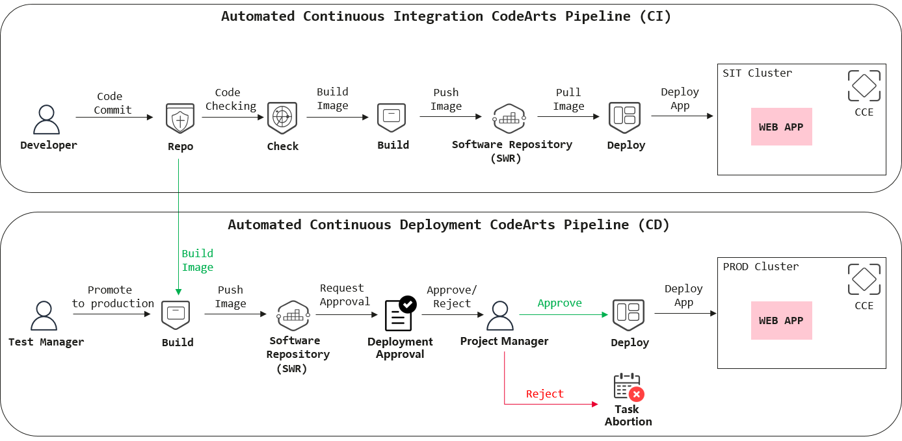

# Solution  Overview for Huawei CodeArts CI/CD

 Figure 6.0.0: Create CodeArts Project Repository 

Figure above is the overall diagram outlining all the elements that will be used to build up the **CI/CD pipeline** to deploy the web application to different environments with image version tagging. It consists mainly of two different parts, an **automated continuous integration CodeArts Pipeline (CI)** and an **automated continuous deployment CodeArts Pipeline (CD)**. The environment is being built on the Huawei Cloud Container Engine (CCE) cluster and there is a total of two CCE clusters that represent SIT and Production environment.

For the **automated continuous integration** [CodeArts pipeline](https://support.huaweicloud.com/intl/en-us/cloudpipeline/index.html), the developer is responsible for committing the change to the source code hosted in [CodeArts Repo](https://support.huaweicloud.com/intl/en-us/codehub/index.html). Upon the code commit from the developer, this action will trigger the pipeline to execute the task configured in the pipeline. The first task being executed is Code Checking, the [CodeArts Check](https://support.huaweicloud.com/intl/en-us/codecheck/index.html) service will scan through the source code to detect if there is any syntax error that does not comply with the rules that had been pre-configured and applied to the source code. If it passed all the rules, then it will start to execute the build task in which a container image was built and pushed to the [Software Repository Warehouse (SWR)](https://support.huaweicloud.com/intl/en-us/productdesc-swr/swr_03_0001.html) with the use of the function configured in [CodeArts Build](https://support.huaweicloud.com/intl/en-us/cloudbuild/index.html). The last step involves the deployment to the SIT environment, the container image was pulled from the SWR service with the specified image tag to be used to deploy to the SIT environment by the function that has been configured in the [CodeArts Deploy](https://support.huaweicloud.com/intl/en-us/clouddeploy/index.html).

For the **automated continuous deployment** CodeArts pipeline, the test manager is responsible for manually triggering the production pipeline to deploy the web application to the production cluster. The pipeline will stop until the project manager had reviewed the deployment and **manually approve the deployment** to the production environment. The process is similar to the task being executed in the CI pipeline. In total, there will be two different container images hosted in the SWR service, one for SIT environment and another for the production environment. Each of the images has multiple versions being tagged from time to time.
In summary, the web application is deployed to the SIT environment with image version tagging before it can be released to the production environment with approval from the project manager.