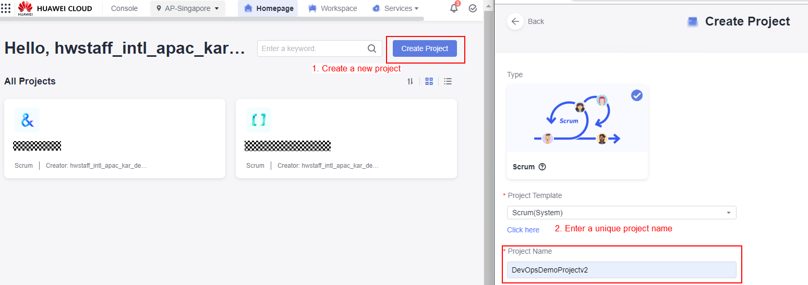
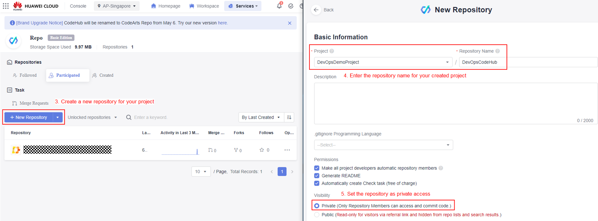
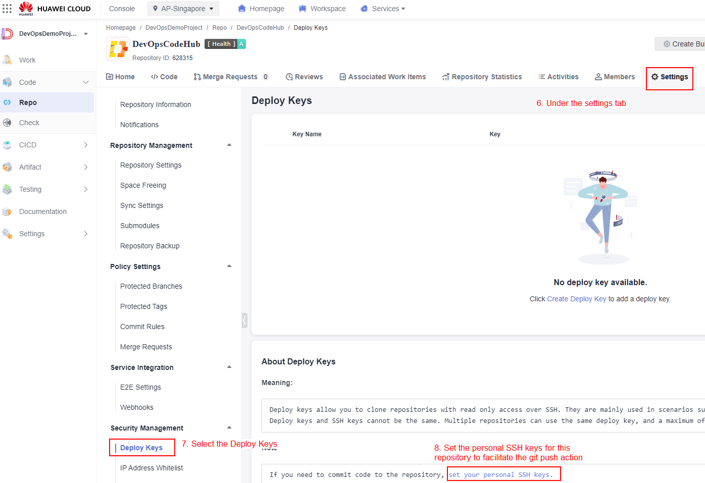
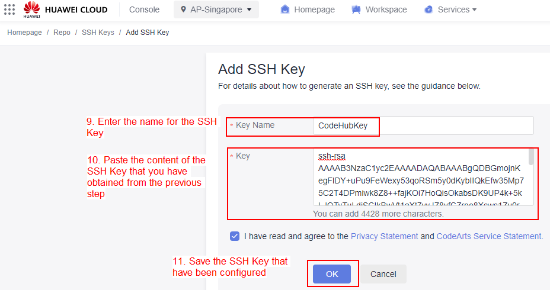
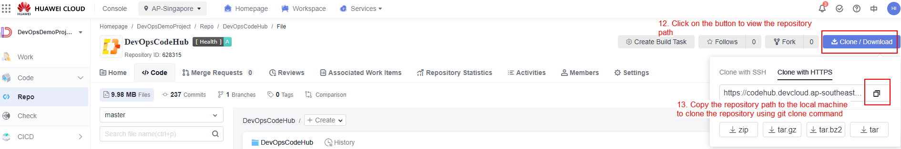
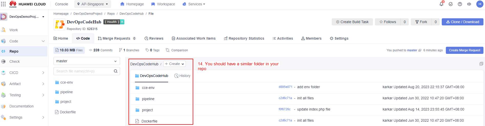

# Getting Started

### Set up the project and repository

This section will guide you step by step to set up the project and repository in Huawei CodeArts service. It involves creating a new project and repository in the CodeArts and configuring the SSH keys in the repository for you to commit source code to the repo.

1. Navigate to the CodeArts management console page, and create a new project by following the instructions in the below screenshot.

    

<p align="center"> Figure 7.1.0: Create CodeArts Project </p>

2. Under the services tab, create a new repository by following the instructions in the below screenshots.

    

<p align="center"> Figure 7.1.1: Create CodeArts Project Repository </p>

3. Before you can clone the private repository, or perform any git push actions, you should always set the personal SSH keys to grant the permission of your local machine to the private repository. Follow the instruction below to set the permission for the private repository.



<p align="center"> Figure 7.1.2: Configure SSH Key </p>

4. Run the below command to generate the SSH key from your local machine. The resulting output will prompt you the path to where your SSH Keys have been stored.

    ```$ ssh-keygen```

5. Navigate to the directory shown in Step 4 and type the below command to view the SSH Keys. Copy the SSH Keys content for later use.

    ```$ cat id_rsa.pub```

6. Continue to configure the SSH Key in the repository from Step 3.



<p align="center"> Figure 7.1.3: Configure SSH Key </p>

7. Clone the repository to your local machine by following the instructions in the below screenshot.



<p align="center"> Figure 7.1.4: Clone Project Repository </p>

Open an integrated terminal in Visual Studio Code, or any other terminal, and enter the command below to clone the repository.

```$ git clone https://replace-it-with-your-repository-path```

8. Obtain the source code template by cloning the repository with the below command.

    ```$ git clone https://the-source-code-template```

9. Copy all the folders and files that you have obtained in Step 8 into your own repository in Step 7. After that, commit the source code into Repo in Huawei Cloud CodeArts by entering the below command.

    ```$ git add --all```

    ```$ git commit -am “init all files”```

    ```$ git push```



<p align="center"> Figure 7.1.5: Git commit files to Project Repository </p>