# Getting Started

### Set up the project and repository

This section will guide you step by step to set up the project and repository in Huawei CodeArts service. It involves creating a new project and repository in the CodeArts and configuring the SSH keys in the repository for you to commit source code to the repo.

1. Navigate to the CodeArts management console page, and create a new project by following the instructions in the below screenshot.

    

    *<p align="center"> Figure 7.1.0: Create CodeArts Project </p>*

2. Under the services tab, create a new repository by following the instructions in the below screenshots.

    

    *<p align="center"> Figure 7.1.1: Create CodeArts Project Repository </p>*

3. Before you can clone the private repository, or perform any git push actions, you should always set the personal SSH keys to grant the permission of your local machine to the private repository. Follow the instruction below to set the permission for the private repository.

    

    *<p align="center"> Figure 7.1.2: Configure SSH Key </p>*

4. Run the below command to generate the SSH key from your local machine. The resulting output will prompt you the path to where your SSH Keys have been stored.

    ```$ ssh-keygen```

5. Navigate to the directory shown in Step 4 and type the below command to view the SSH Keys. Copy the SSH Keys content for later use.

    ```$ type id_rsa.pub```

6. Continue to configure the SSH Key in the repository from Step 3.

    

    *<p align="center"> Figure 7.1.3: Configure SSH Key </p>*

7. Clone the repository to your local machine by following the instructions in the below screenshot.

    

    *<p align="center"> Figure 7.1.4: Clone Project Repository </p>*

    Open an integrated terminal in Visual Studio Code, or any other terminal, and enter the command below to clone the repository.

    ```$ git clone https://replace-it-with-your-codearts-repo```

8. Obtain the source code template by cloning the repository with the below command.

    ```$ git clone https://github.com/hwcloud-apac-pso/huawei-codearts-workshop.git```

9. Copy all the folders under the ```./pipeline-deployment``` directory that you have obtained in Step 8 into your own repository in Step 7. After that, commit the source code into Repo in Huawei Cloud CodeArts by entering the below command.

    ```$ git add --all```

    ```$ git commit -am “init all files”```

    ```$ git push```

    

    *<p align="center"> Figure 7.1.5: Git commit files to Project Repository </p>*

### Set up the production and non-production Cloud Container Engine (CCE) environment

This section guides you on preparing the CCE clusters for two environments, SIT and production in the Singapore region using Terraform. It also involves configuring the CCE clusters service endpoints in your CodeArts project in order to facilitate the web application deployment. 

1. Provision the CCE cluster as a production cluster and non-production cluster. Navigate to the ```cceenv/sit-demo``` and ```cceenv/prod-demo``` folder directory, and look for the ```provider.tf``` file. Insert the AK and SK inside the provider block. Run the terraform command below to provision the CCE cluster for production and non-production environment. You should see a similar result as the below screenshots.

    Navigate to the cceenv/sit-demo directory, and execute the command below:

    ```$ terraform fmt```

    ```$ terraform init```

    ```$ terraform validate```

    ```$ terraform plan```

    ```$ terraform apply```

    Navigate to the cceenv/prod-demo directory, and execute the command below:

    ```$ terraform fmt```

    ```$ terraform init```

    ```$ terraform validate```

    ```$ terraform plan```
    
    ```$ terraform apply```

    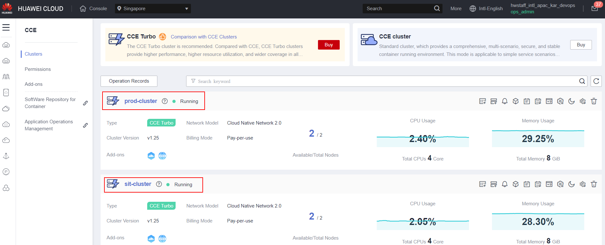

    *<p align="center"> Figure 7.2.0: CCE Cluster for Production and Non-Production Environment </p>*

2. Obtain the ```kubeconfig``` file for every single cluster to configure service endpoints in CodeArts by following the instructions in the below screenshots.

    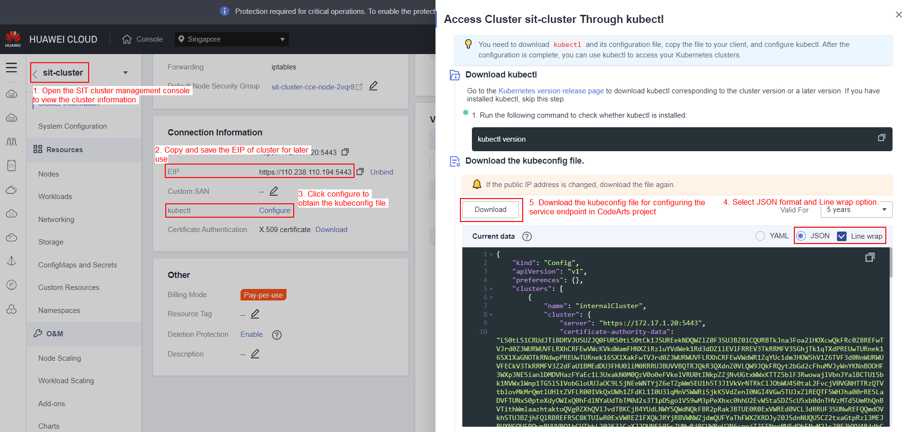

    *<p align="center"> Figure 7.2.1: Obtain kubeconfig file in CCE Cluster </p>*

3. Configure the service endpoints for the non-production CCE cluster under your project in CodeArts by following the instructions in the below screenshot.

    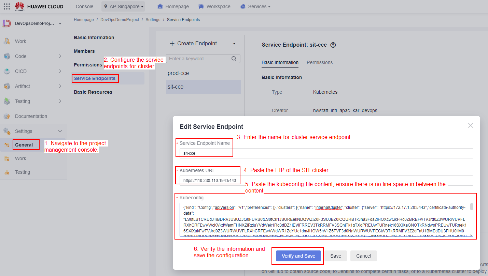

    *<p align="center"> Figure 7.2.2: Configure Service Endpoints for non-production CCE Cluster in CodeArts Project </p>*

4. Configure the service endpoints for the production CCE cluster under your project in CodeArts by following the instructions in the below screenshot.

    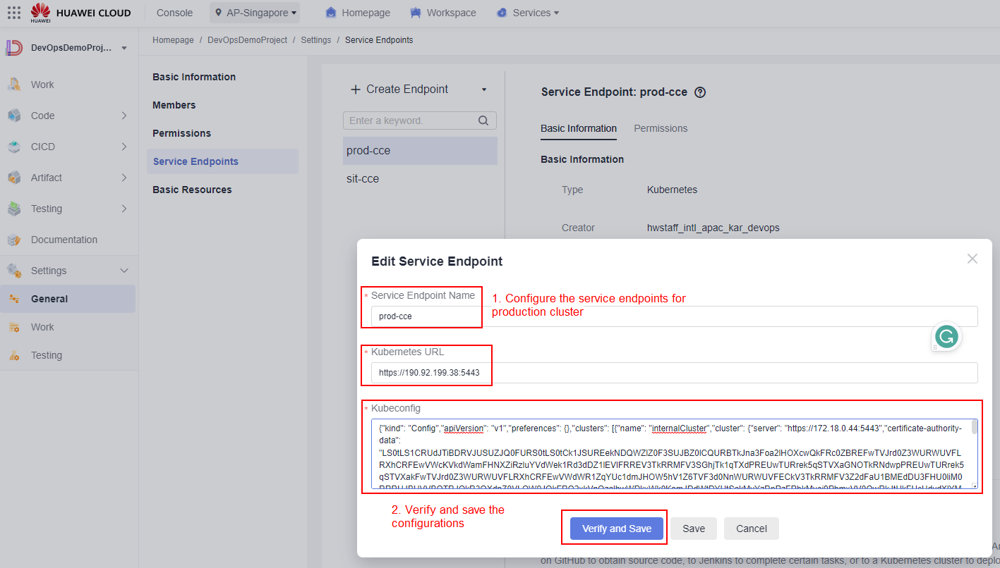

    *<p align="center"> Figure 7.2.3: Configure Service Endpoints for production CCE Cluster in CodeArts Project </p>*

### Configure the Continuous Integration Pipeline task

1. Configure the CodeArts Build task for the pipeline using Build services in CodeArts by following the instructions in the below screenshots.

    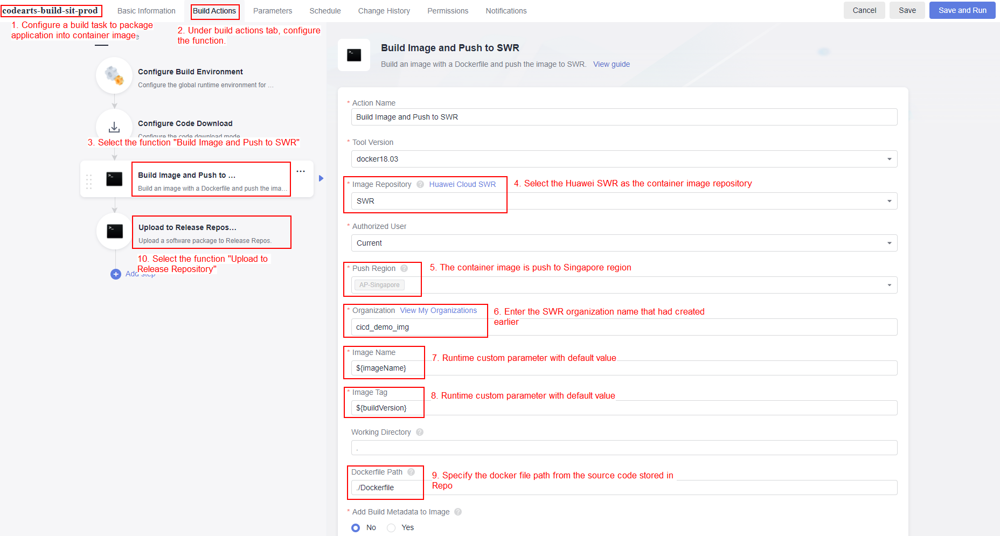

    *<p align="center"> Figure 7.3.0: Configure CodeArts Build Task </p>*

    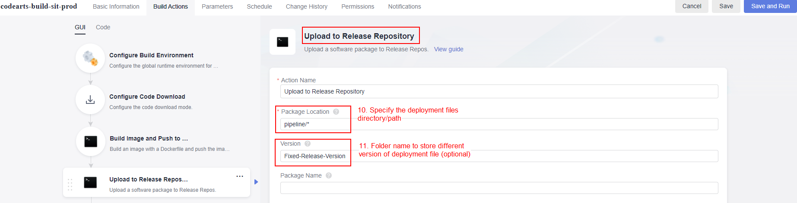

    *<p align="center"> Figure 7.3.1: Configure CodeArts Build Task </p>*

    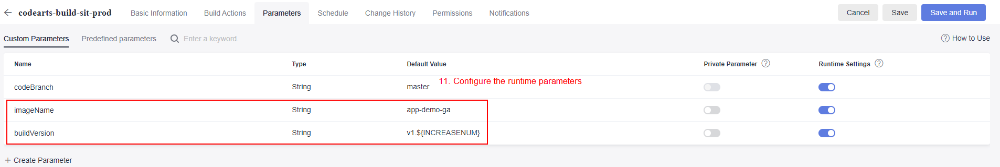

    *<p align="center"> Figure 7.3.1.1: Configure CodeArts Build Task </p>*

    Once you have configured the task, run the build task manually for the first time.

    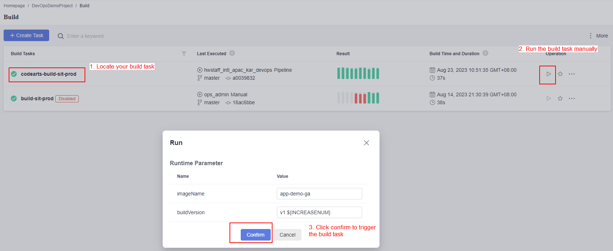

    *<p align="center"> Figure 7.3.1.2: Run the CodeArts Build Task </p>*

2. Configure the CodeArts Deployment task for the pipeline using Deploy services in CodeArts by following the instructions in the below screenshots.

    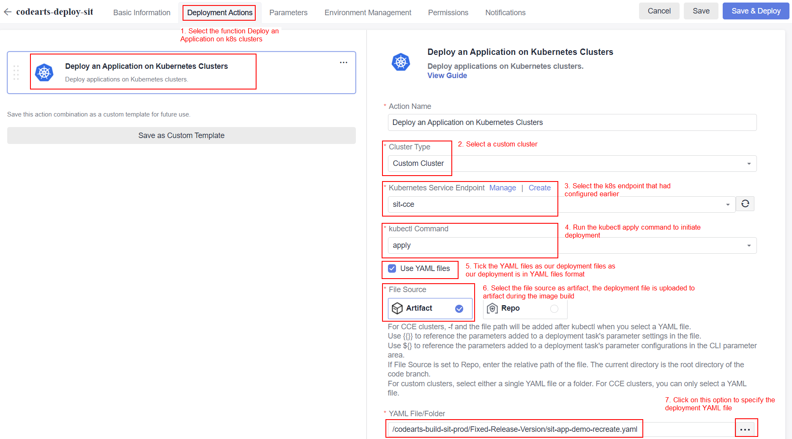

    *<p align="center"> Figure 7.3.2: Configure CodeArts Deployment Task for non-production CCE cluster </p>*

    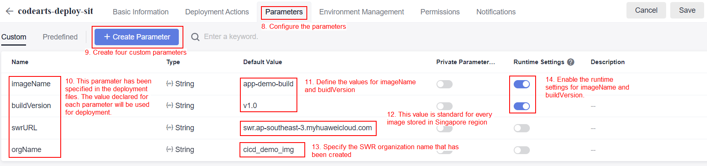

    *<p align="center"> Figure 7.3.3: Configure CodeArts Deployment Task for non-production CCE cluster </p>*

3. Configure the CodeArts Pipeline using the Pipeline services in CodeArts by following the instructions in the below screenshots.

    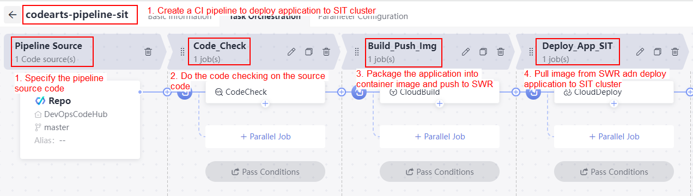

    *<p align="center"> Figure 7.3.4: Configure CodeArts Pipeline for non-production CCE cluster </p>*

    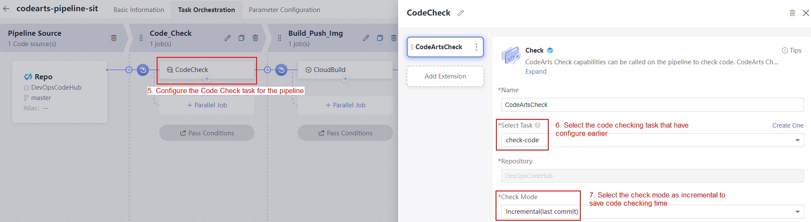

    *<p align="center"> Figure 7.3.5: Configure CodeArts Pipeline for non-production CCE cluster </p>*

    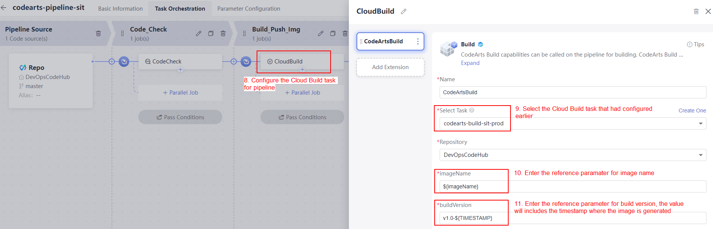

    *<p align="center"> Figure 7.3.6: Configure CodeArts Pipeline for non-production CCE cluster </p>*
 
    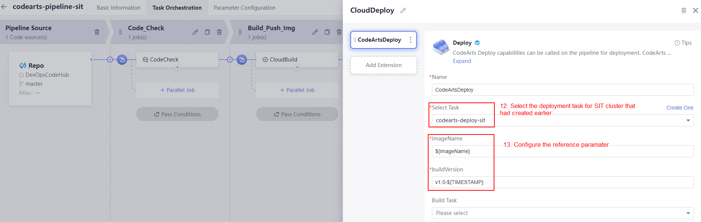

    *<p align="center"> Figure 7.3.7: Configure CodeArts Pipeline for non-production CCE cluster </p>*

4. Configure the CodeArts Pipeline parameters by following the instructions in the below screenshots.

    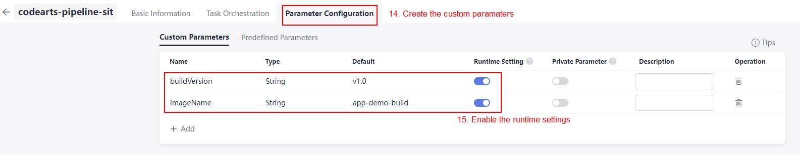

    *<p align="center"> Figure 7.3.8: Configure CodeArts Pipeline for non-production CCE cluster </p>*

5. Configure the CodeArts Pipeline execution plan by following the instructions in the below screenshots.

    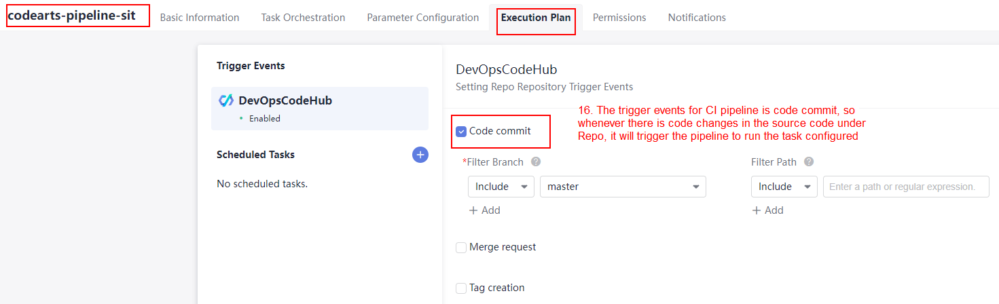

    *<p align="center"> Figure 7.3.9: Configure CodeArts Pipeline for non-production CCE cluster </p>*

### Configure the Continuous Deployment Pipeline task

1. Configure the CodeArts Deployment task for the pipeline using Deploy services in CodeArts by following the instructions in the below screenshots. There are two deployment tasks where each of which uses different YAML deployments files.

    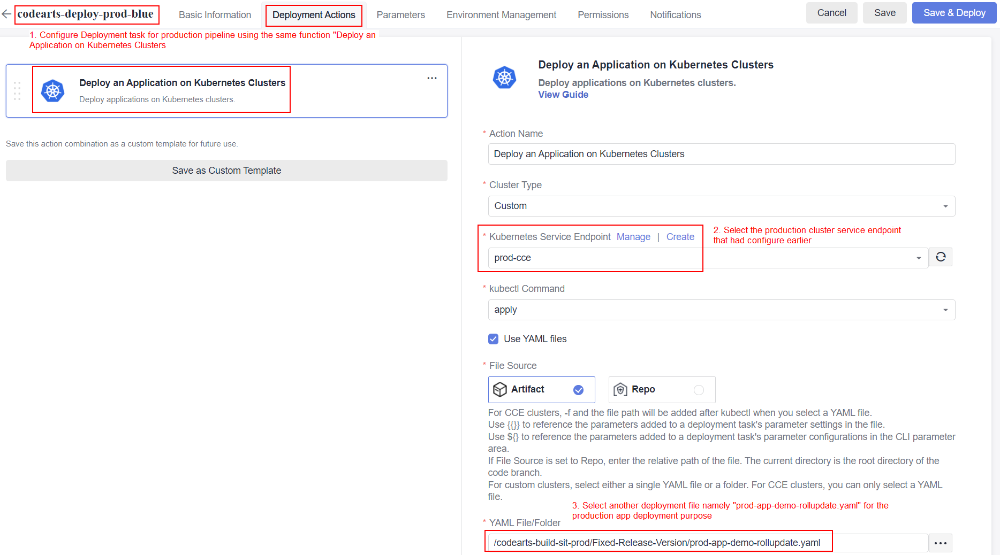

    *<p align="center"> Figure 7.4.0: Configure CodeArts Deployment Task for production CCE cluster (1st version application) </p>*

    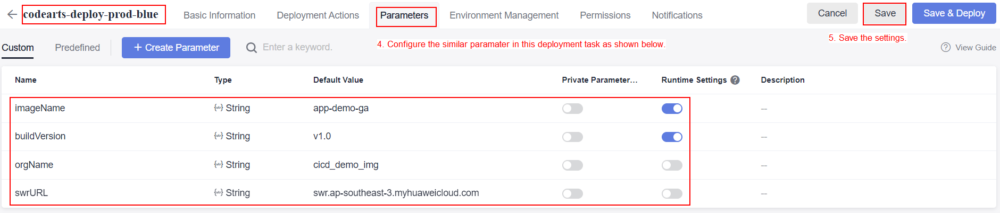

    *<p align="center"> Figure 7.4.1: Configure CodeArts Deployment Task for production CCE cluster (1st version application) </p>*

    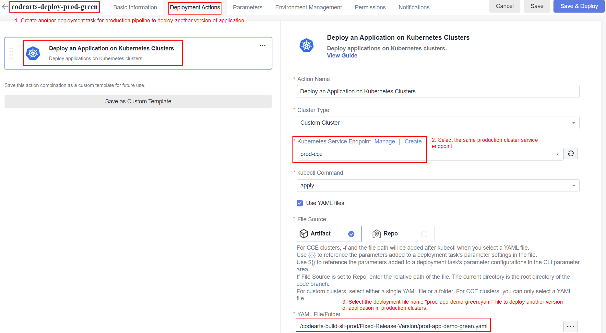

    *<p align="center"> Figure 7.4.2: Configure CodeArts Deployment Task for production CCE cluster (2nd version application) </p>*

    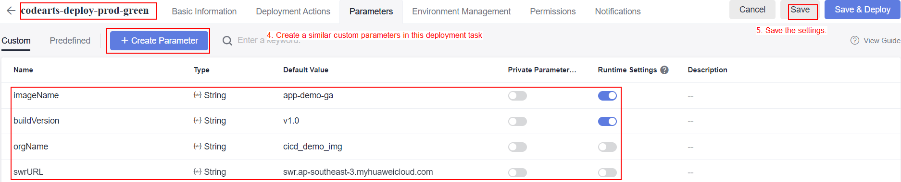

    *<p align="center"> Figure 7.4.3: Configure CodeArts Deployment Task for production CCE cluster (2nd version application) </p>*

2. Configure the CodeArts Pipeline using the Pipeline services in CodeArts by following the instructions in the below screenshots.

    

    *<p align="center"> Figure 7.4.4: Configure CodeArts Pipeline for production CCE cluster (1st version application) </p>*

3. Configure the CodeArts Pipeline parameters by following the instructions in the below screenshots.

    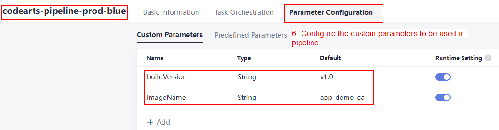

    *<p align="center"> Figure 7.4.5: Configure CodeArts Pipeline for production CCE cluster (1st version application) </p>*

    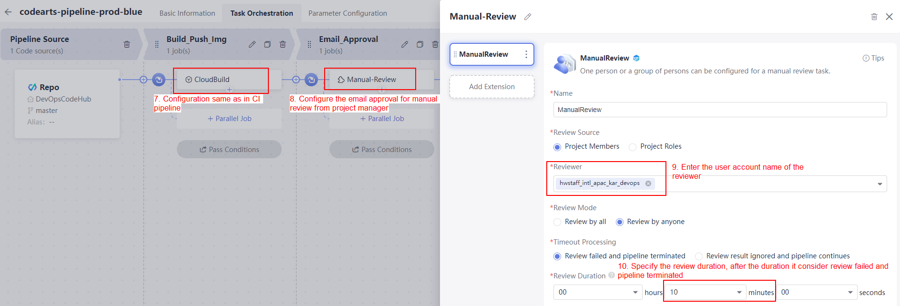

    *<p align="center"> Figure 7.4.6: Configure CodeArts Pipeline for production CCE cluster (1st version application) </p>*

    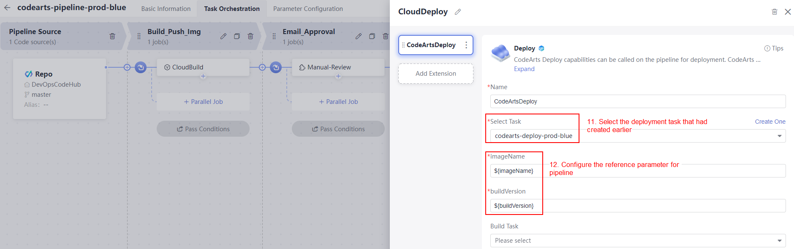

    *<p align="center"> Figure 7.4.7: Configure CodeArts Pipeline for production CCE cluster (1st version application) </p>*

    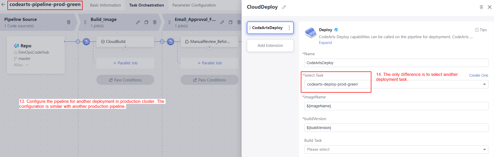

    *<p align="center"> Figure 7.4.8: Configure CodeArts Pipeline for production CCE cluster (2nd version application) </p>*