# Result Validation

This section is to validate the functionality of the continuous integration and continuous deployment pipeline in order to deploy a web application to the SIT and Production cluster. It involves deploying the web application to the SIT cluster before the version of the application can be released to the production environment. The version of the web application to be released to both environments is in red color background. Throughout different testing, we will use different color-coded backgrounds to represent different versions of the application to be released to the SIT and Production environment.

###	Validation of System Integration Testing (SIT) Environment
1. Look for the index.php file under the CodeArts-Repo-Name/index.php directory, within the <style> tag, uncomment the scripts for the background parameter where the value represents the red color as in the below screenshots.

    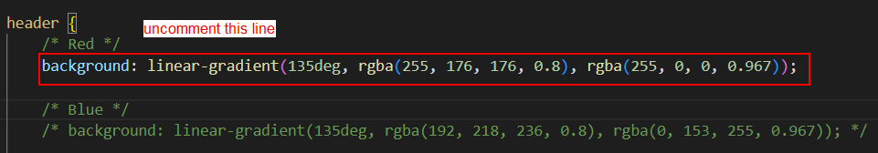

<p align="center"> Figure 8.1.0: Modify the index.php file </p>

2. Within the <style> tag, uncomment the scripts for the background parameter for all the sections as mentioned below:
    * .highlight-box {}
    * footer {}
    * .shaded-section h2 {}

3. Once modify the code, commit changes to the CodeArts Repo using the below command to trigger the SIT pipeline by following the instructions in the below screenshot.

    ```$ git commit -am “deploy history red version”```

    ```$ git push```

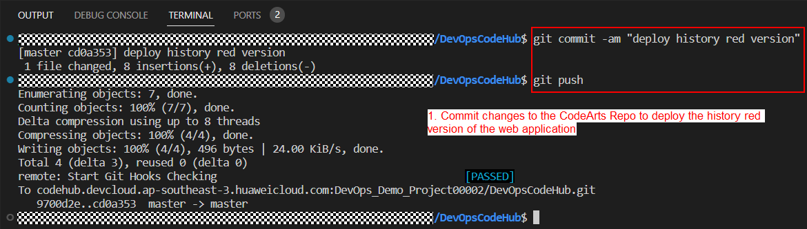

<p align="center"> Figure 8.1.1: Commit changes to the CodeArts Repo </p>

4. Navigate to the CodeArts Pipeline management console, and verify the SIT pipeline was triggered upon source code commit.

    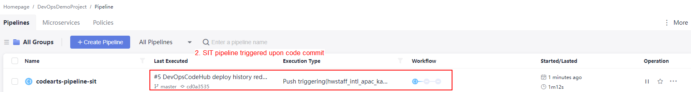

<p align="center"> Figure 8.1.2: Verify the SIT pipeline was triggered upon code commit </p>
    
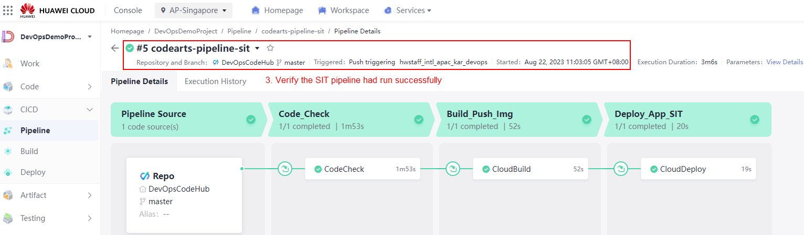

<p align="center"> Figure 8.1.3: Verify the SIT pipeline had run successfully </p>

5. Once the pipeline had run successfully, configure a load balancer in the SIT cluster in order to access the web application using the EIP bound. Follow the instructions in the below screenshot to configure the ELB.

    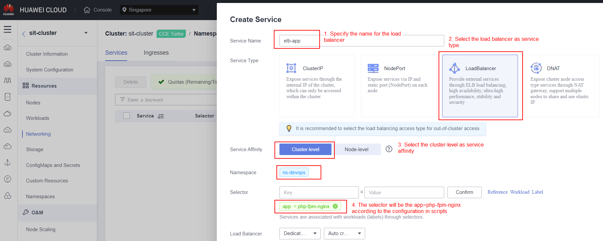

<p align="center"> Figure 8.1.4: Verify the SIT pipeline had run successfully </p>

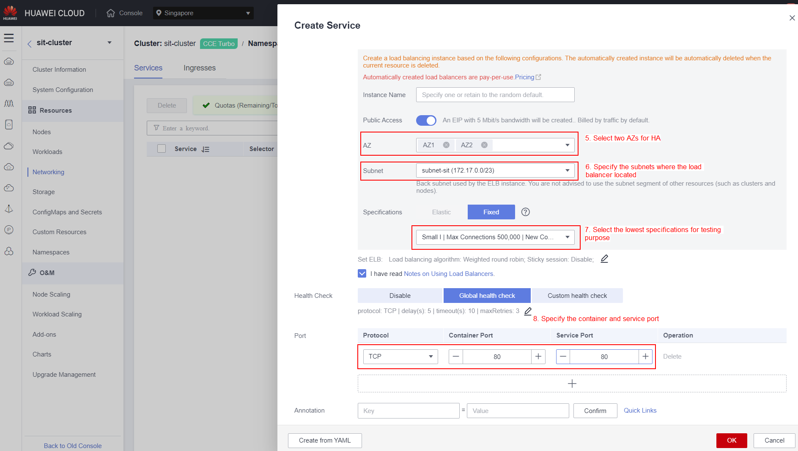

<p align="center"> Figure 8.1.5: Verify the SIT pipeline had run successfully </p>

6. Obtain the EIP address of the load balancer and paste it into any web browser to access the web application. If you see a similar result as in Figure 2.1.7, it indicates that you had completed the configuration and validation on the CI pipeline.

    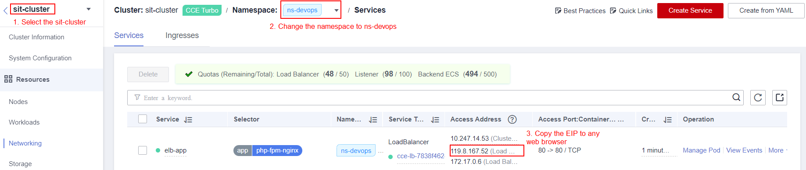

<p align="center"> Figure 8.1.6: Obtain the EIP address of the load balancer </p>

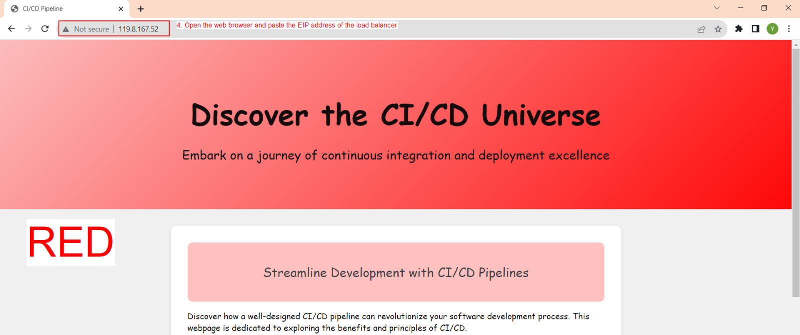

<p align="center"> Figure 8.1.7: Verify the web application </p>

7. In the meantime, you can also check the container image that had built using the SIT pipeline. Navigate to the Software Repository Warehouse (SWR) management console, and verify the container image built.

    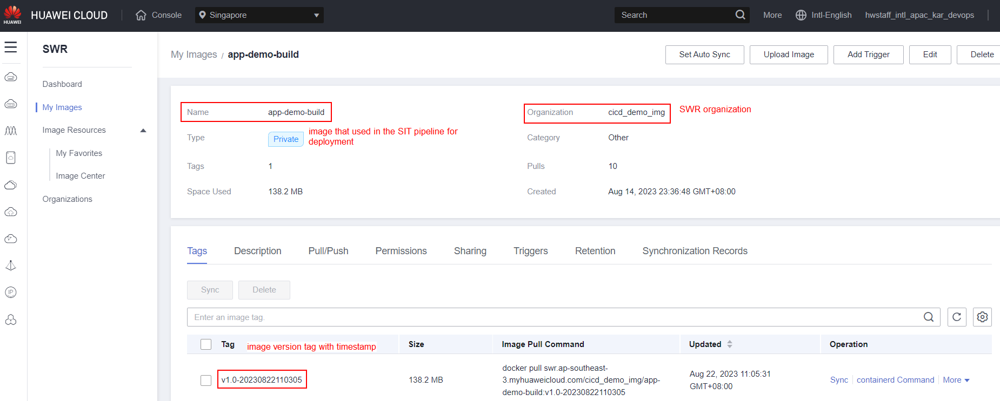

<p align="center"> Figure 8.1.8: Container image built and pushed to SWR </p>

### Validation of Production Environment

1. For the production pipeline, we need to manually trigger the pipeline with the use of the same piece of code that had been submitted during the validation on SIT environment. As the pipeline is triggered manually, we need to set the runtime parameters such as the buildVersion and imageName. Set the runtime parameters with the below information and follow the instructions in the below screenshots.

    buildVersion: v1.0
    imagName: app-demo-build

    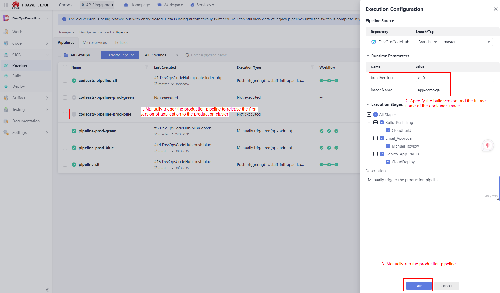

<p align="center"> Figure 8.2.0: Manually trigger the production pipeline </p>

2. The production pipeline requires approval from the project manager to approve the deployment to the production cluster as shown in Figure 2.1.8.

    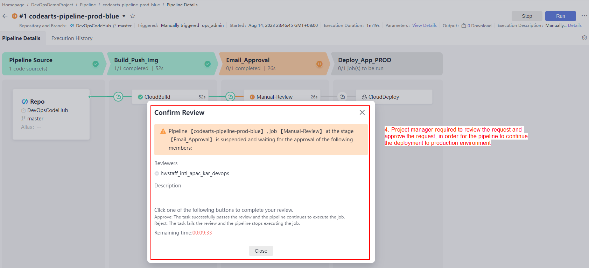

<p align="center"> Figure 8.2.1: Approval from the project manager to approve the deployment to the production cluster </p>

3. If you are the project manager, log in to the Huawei Cloud management console and access the CodeArts Pipeline service. Click on the button as shown in the below screenshots to approve the deployment to the production clusters.

    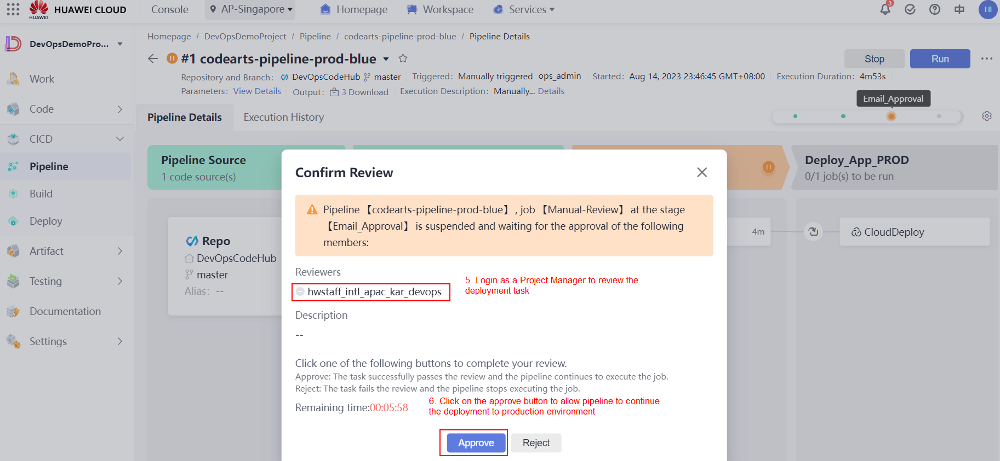

<p align="center"> Figure 8.2.2: Approval from the project manager to approve the deployment to the production cluster </p>

4. Verify the production pipeline where it continues to do the deployment once it is approved by the project manager.

    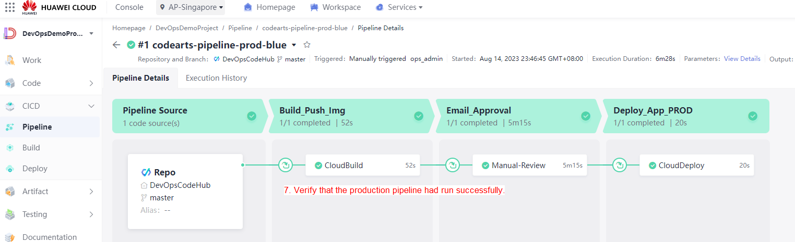

<p align="center"> Figure 8.2.3: Production pipeline run successfully </p>

5. Verify the container image is being pushed to the SWR.

    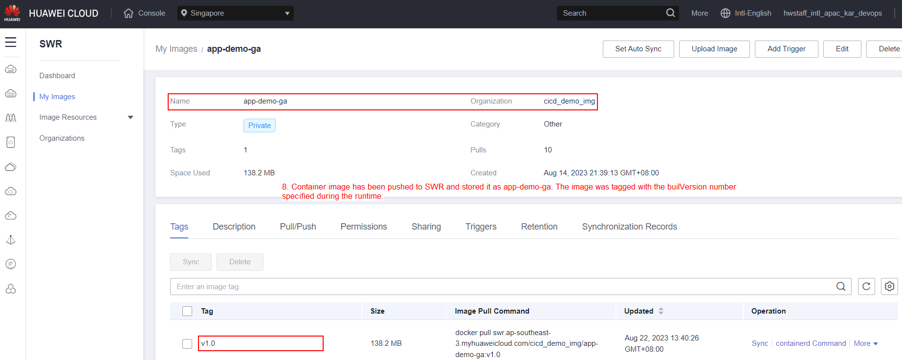

<p align="center"> Figure 8.2.4: Container image built and stored in SWR </p>

6. Configure a load balancer in the production cluster in order to access the web application using the EIP bound. Follow the instructions in Step 4 under section 2.1 to configure the ELB.
 
    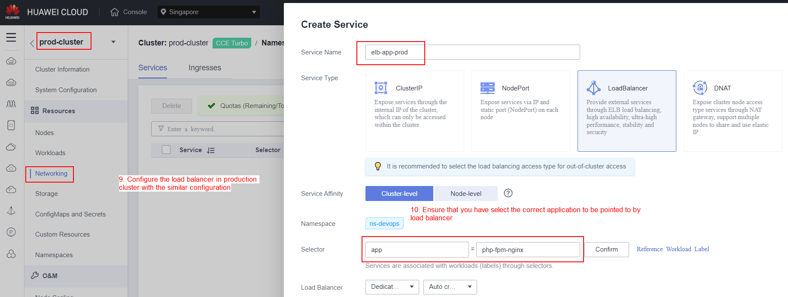

<p align="center"> Figure 8.2.5: Container image built and stored in SWR </p>

7. Obtain the EIP address of the load balancer and paste it into any web browser to access the web application. If you see a similar result as in Figure 2.2.6, it indicates that you had completed the configuration and validation on the CD pipeline.

    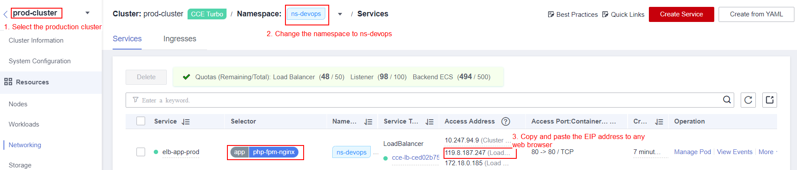

<p align="center"> Figure 8.2.6: Obtain the EIP address of the load balancer </p>


<p align="center"> Figure 8.2.7: Verify the web application </p>