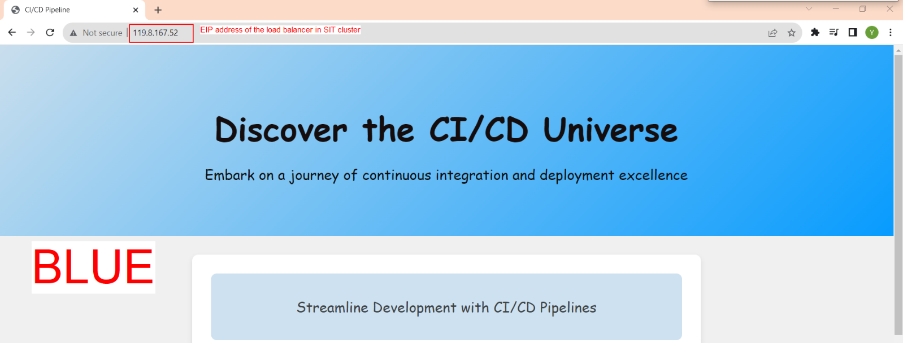
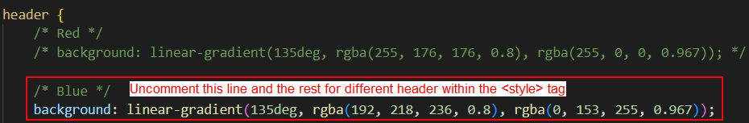
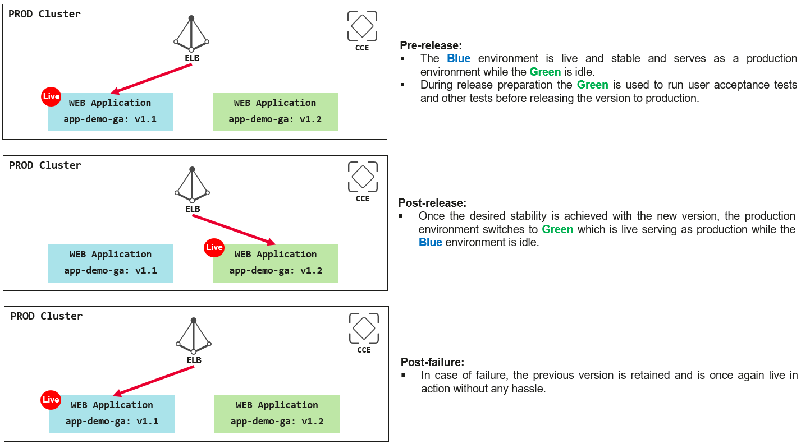
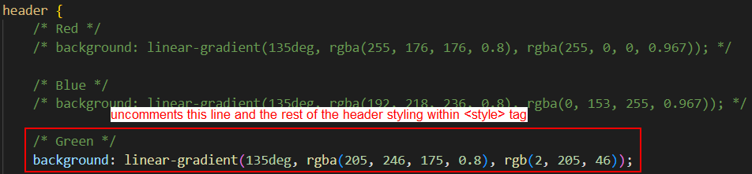
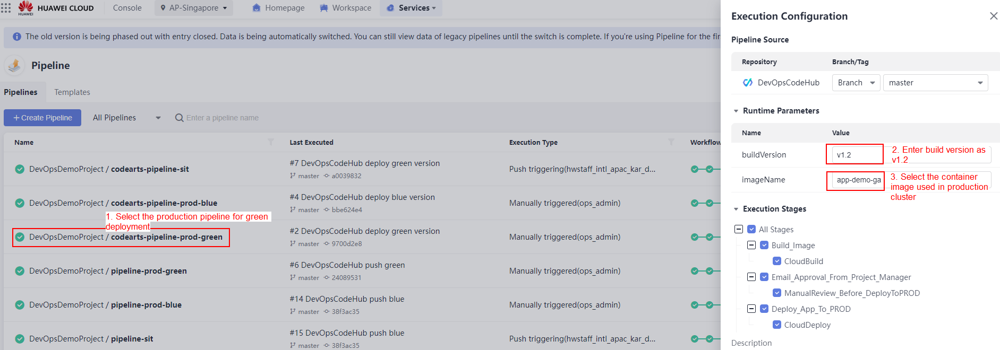
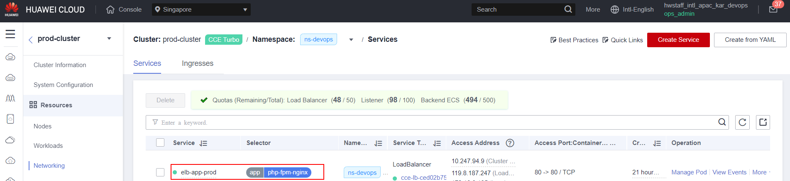
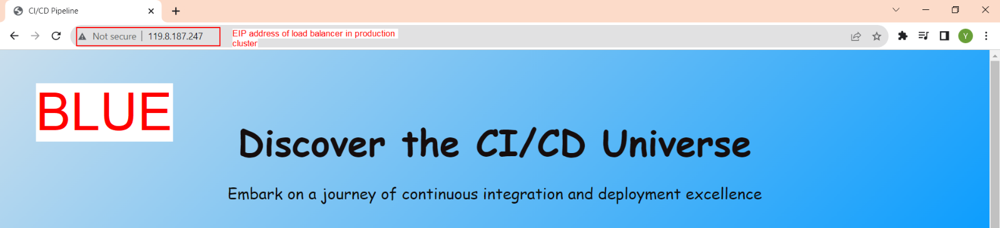
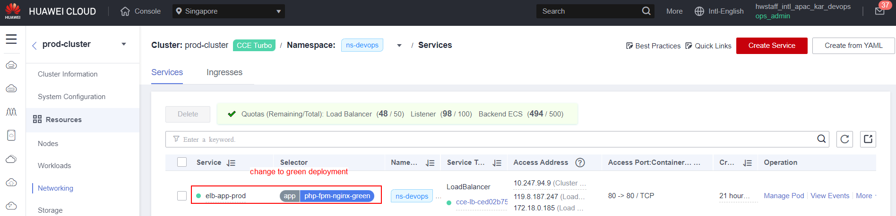
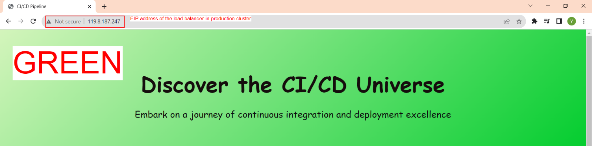
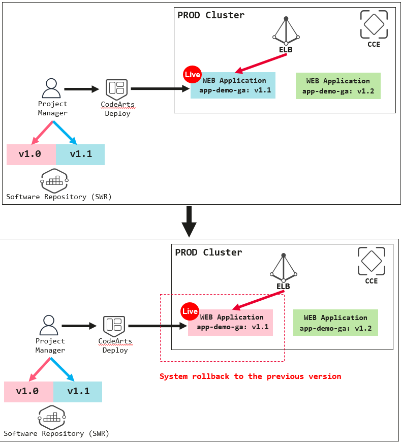

# CI/CD Practice

### Automated Continuous Integration for SIT Environment
1. At this stage, you have a history version of the application in both of your environments (SIT and Production Clusters) with a container image tagged as below.

    SIT Cluster:
    * Image Name: app-demo-build
    * Image Tag: v1.0-timestamp
    * Web Application: red color background

    Production Cluster:
    * Image Name: app-demo-ga
    * Image Tag: v1.0
    * Web Application: red color background

2. Now, we would like to have some changes to the web application by changing the background color of the web page to different color codes including the color codes of the wording. The expected result is shown below.

    

    <p align="center"> Figure 9.1.0: Expected result for new web application </p>

3. To achieve the above result, modify the source code in the index.php file.  Within the <style> tag, perform the actions as in the below screenshots for the styling of different headers.

    

    <p align="center"> Figure 9.1.1: Modify the scripts in the index.php </p>

4. Once modified, commit the changes to the CodeArts Repo, and you should see the SIT pipeline is automatically triggered upon the source code commit. Verify the web application had changed to the blue color background in SIT environment.

5. Deploy a similar application to the production cluster by manually triggering the pipeline with the settings of below runtime parameters.

    * buildVersion: v1.1
    * imageName: app-demo-ga

6. Verify the web application had changed to the blue color background in SIT environment.

### Blue-Green Deployment Strategy for Production Environment </p>

1. At this stage, you have a new version of the application in the production environment with a container image tag as below.

    Production Cluster:
    * Image Name: app-demo-ga
    * Image Tag: v1.1
    * Web Application: blue color background

2. Now, we are going to simulate the blue-green deployment strategy in the production environment. As shown in Figure 9.2.0, there will be two versions of the web application being deployed to the production cluster where one application is in active mode and another remains idle. The load balancer bound to the production cluster will first point to the current version (blue color background, v1.1) of the web application. If the new version of the application (green color background, v1.2) had tested successfully in the SIT environment, then the load balancer will switch to point to the new version of the web application. In case there is any failure in the new release application, you can easily switch back to the previous version as the version is retained in the production environment.

    

    <p align="center"> Figure 9.2.0: Modify the scripts in the index.php </p>

3. To achieve such a deployment strategy, we need to release a new version of the application to the SIT and Production environment. Modify the source code in the index.php file, within the <style> tag, and perform the actions as in the below screenshots for the styling of different headers.

    

    <p align="center"> Figure 9.2.1: Modify the scripts in the index.php </p>

4. Select the production pipeline for green deployment, set the runtime parameters, and initiate the deployment to deploy the web application to the production cluster. 

    

    <p align="center"> Figure 9.2.2: Configure the runtime parameters to initiate the deployment </p>

5. Navigate to the production cluster management console, you should see two deployments with different image tags.

    

    <p align="center"> Figure 9.2.3: Configure the runtime parameters to initiate the deployment </p>

6. To patch the service from blue deployments to green deployments, we will use the command below. Before patching the service, you should have connected to the production cluster from your local machine by following the steps stated in Connect to CCE using kubectl.
    ```$ kubectl -n ns-devops patch service elb-app-prod  -p '{"spec":{"selector":{"app": "php-fpm-nginx-green"}}}'```

7. If you have successfully patched the service from blue to green deployment, you will see a similar result as the below screenshots.
    Before patching,
    
    
    <p align="center"> Figure 9.2.4: ELB before patching </p>

    
    
    <p align="center"> Figure 9.2.5: Web Application before patching </p>

    After patching,
    
    
    <p align="center"> Figure 9.2.6: ELB after patching </p>

    
    
    <p align="center"> Figure 9.2.7: Web Application after patching </p>

### Version control rollback with the use of image tagging for the production environment

To simulate the version control rollback in the production environment, we need to patch the service back to the blue deployment from the last step. This is because the deployment contains two versions of the web application (red and blue color background). We can simulate the scenario of version rollback of the web application from version v1.1 (blue color background) to v1.0 (red color background). 

1. First, run the command below to point the ELB to the blue deployment.

    
    
    <p align="center"> Figure 9.3.0: ELB of Production Cluster </p>

2. Access the web application to ensure that the web application is in blue color background.

3. Navigate to the CodeArts Deploy service, and search for the deploy task where the buildVersion is v1.0. Rollback the wen application to v1.0 which represents the red color background.

    
    
    <p align="center"> Figure 9.3.1: Version Rollback </p>

4. Verify the web application had rollback to the history version of the red color background.